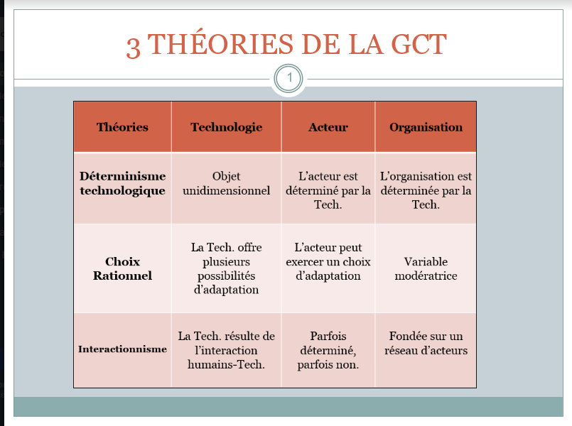

#
# Séance 10

## Régulation des déviances et gestion du changement Technologique

## Plan
    1. Dispositifs de régulation
        a. Les 3 formes de régulation
        b. Gestion du changement technologique (GCT)
        c. Normes ISO

    2. Transfert technologique (TT)
        a. Définition et préalables du TT
        b. TT et déterminisme technologique
        c. TT entre université et indutries.

## Les dispositifs de régulation sociale
**Définition**
- Ensemble de règles formelles et informelles produites pour:
    1. **Réguler** les activités d'une société.
    2. **Normaliser** les interactions entre les différents acteurs sociaux.

**Rôle des dispositifs de régulation**

    1. Faire accompagner le nouveau système technique par un nouveau système de normes juridiques et sociales.

    2. Éviter «l'anomie(exclusion sociale) sociale».

## Les 3 différentes formes de régulation sociale
1. **Régulation autonome**
    - Règles autoproduites par les membres d'une société conformément à leurs intérêts et à leurs valeurs.

    **Exemples**
    - Dans le monde scientifique: validation par les pairs.
    - Wiki


2. **Régulation de contrôle**
    - Exercée par les États ou les organisations (entreprises).

    **Exemples**
    - Réglementation étatique d'internet.
        - La loi sur la protection des renseignements personnels et les documents électroniques.
    - Règlements des entreprises.


3. **Régulation conjointe**
    - Synthèse de la régulation autonome et de la régulation de contrôle (règles formelles et informelles).
    - Implique la participation de différents groupes. (états, entreprises, groupes sociaux)

## TIC et enjeux de la refonte des dispositifs de régulation

1. **L'inadaptation des textes de lois au contexte virtuel.**
    - Ex: Copyright, jeu en ligne, Charte des droits.

2. **La nécessité de développer des nouveaux outils d'investigation.**
    - Ex: Lutte contre la cybercriminalité, e-surveillance.
3. **L'extraterritorialité du système Internet.**
    - Enjeux des collaborations entre nations.

## Gestion du changement technologique (GCT)

**La GCT**
- Planifier, organiser, diriger, contrôler tout projet d'automatisation et/ou d'information dans une organisation ou une société.

**GOC (Gestion des opérations courantes)**:
- Les opérations normales, habituelles, routinières d'une organisation.

## Théories de la GCT
1. Le déterminisme technologique
    - La performance de la technologie est le seul paramètre considéré.
2. La théorie du choix rationnel
    - L'individu peut utiliser la tech d'une façon différente à ce qui est entendu par le développeur.
3. L'interactionnisme
    - Dire qu'il faut trouver un équilibre entre les impacts de la tech et la marge de manœuvre qu'on peut laisser aux individus pour s'approprier et accepter la tech.
    - Processus itératif entre usager et producteurs



## Exemple: Système de paie Phénix
- 1970: Ancien système régional de paye (SRP)
- 2010: PeopleSoft développé par Oracle
    - Centraliser le système de paie de 101 ministères et organismes.
    - 80 000 règles relatives à la rémunération.


## Actions concrètes de la GCT
- L'information du personnel
- L'implication du personnel.
- La formation du personnel.
- La gestion du personnel.
- L'implication de la hiérarchie.
- Négociations avec les syndicats.
- L'organisation du travail.

## Les 5 étapes de la GCT


## Texte du recueil sur la GCT
(texte 7)
- Répondre à 2 questions en lisant le texte;
    1. Être en mesures d'identifier les 3 « leviers », ou facteurs, menant à la réussite de la GCT.
    2. Être capable de décrire en quoi consiste chacun de ces 3 leviers.

## Les normes ISO

Lié à la société post-industrielle.

### Définition
Normes de   qualité, de compatibilité, de sécurité, qui touchent à divers domaines (techniques, managériaux, environnementaux, etc.)

Elles peuvent toucher:
- La qualité technique du produit (normes FORTRAN ou C)
- La qualité de l'entreprise (ISO 9001 pour le management)
- La qualité de l'environnement (ISO 14001)

Dispositifs de normes techniques portant sur la **qualité totale** du produit.

```
                  Qualité totale
                        =
                Qualité du produit
                        +
        Qualité des conditions de production
```

## Émergence d'une économie de la qualité

    «Qualité» + «Information sur la qualité»
Stratégie de différentiation des entreprises


## Les acteurs et enjeux des normes ISO

### Acteurs
- Entreprises
- Pouvoirs publics
- Organisations de consommateurs

### Enjeux
- Ouvrent l'accès aux marchés à certaines entreprises et le ferment à d'autres.

- Font partie d'une stratégie de conquête des marchés globaux.


