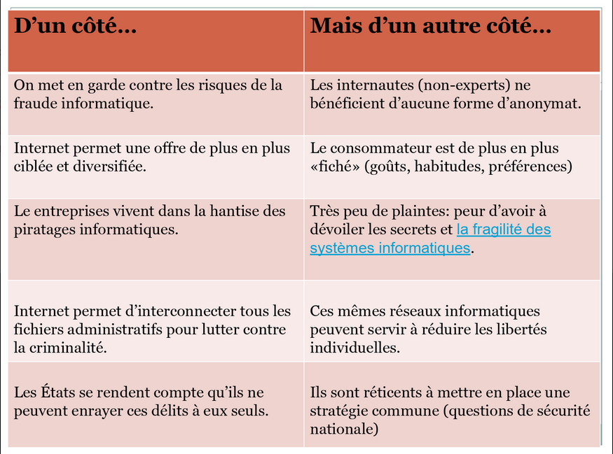

# 
# Séance 9
# Déviance

**En sociologie**

```
Désigne une conduite qui s'écarte des normes sociales en vigueur, qui les transgresse ou qui les conteste.
```
**Dans le contexte des NT**:

```
Désigne les comportements indésirables, prévus ou imprévus, liés à l'utilisation des NT.
```

Exemples liés aux NT 
- cybercriminalité
- Prolifération des discours haineux sur les RS
- Atteinte à la vie privée
- Phénomène d'addiction
- Hacktivisme


## Quelques facteurs favorisant les comportements déviants
```
1. Le sentiment de marginalité ou de non-intégration à la communauté.

2. Le refus d'adhérer au système de valeurs lorsqu'il est perçu comme illégitime.

3. Le sentiment d'injustice sociale, économique ou politique.

4. La volonté de défier les systèmes techniques et donc les systèmes sociaux qui les sous-tendent.
```

## Évolution de la délinquance informatique

- 1ère PHASE (début des années 1980)
    - Introduction massive des ordinateurs dans les entreprises.
    - Piratage de logiciels, qui sont alors rares et coûteux.

- 2ème PHASE (fin des années 1980)
    - Émergence et extension des réseaux informatiques
    - Popularisation du «hacking».
    - Volonté de défier les systèmes techniques et de montrer leur vulnérabilité.

- 3ème PHASE (années 1990)
    - L'information devient une valeur stratégique.
    - Du hacker isolé aux organisations, parfois très puissantes.

- 4ème PHASE (années 2000)
    - Explosion de la cybercriminalité (téléchargement illégal, acte de «phishing», vol d'informations personnelles, etc).
    - Militantisme des hackers (Anonymous, Chaos Computer Club)

- 5ème PHASE (années 2010)
    - Apparition du phénomène des «leaks» (fuite massive des données)
    - Figure du lanceur d'alerte

## Les postulats de la délinquance informatique (un phénomène inévitable)

```
1. Toute entreprise détient des informations stratégiques intéressant au moins ses concurrents.

2. Tout système informatiqu comporte au moins une faille, et peut donc être contourné.

3. Quiconque a accès à ce système d'information est susceptible d'en découvrir les failles.

4. (+) les risques de se faire prendre sont fiables et (+) la probabilité d'utilisation malveillante est élevée.
```

## Quelques exemples d'infraction
```
1. Le faux et usage de faux informatique
S'introduire dans une système informatiques dans l'intention de se procurer un avantage frauduleux.

3. Le sabotage/ hacking
    - Manipuler des données dans le but de nuire.
    - Accéder de manière illicite à un système informatique dans le but d'en exposer les vulnérabilités ou les failles.
```

## L'ambivalence de la société d'information
- La difficulté de combattre la criminalité informatique est liée à l'**ambigüité** qui caractérise la société de l'information.

- Les délits informatiques suscitent en même temps **crainte/réprobation** et **admiration**.

**Quelles sont les sources de cette ambivalence?**
 
 

# Les groupes de pressions

## Définition et caractéristiques 

### Définition
- Groupes ou association qui cherchent à infléchir la décision des pouvoirs publics en faveur d'une cause donnée.

-  L'action des GP prend diverses formes:
    - explicite (publique)
    - discrète (ex: lobby)
    - souterraine (ex: corruption)

## Efficacité des groupes de pression

- Repose sur la **qualité** plutôt que sur la quantité de ses membres.

- **Cette qualité est définie par:**
    - Leur pouvoir financier
    - Leurs capacité intellectuels.
    - Leur capital relationnel (carnet d'adresse, contacts dans les médias.)

## Le lobbyisme scientifique
Lien «Les marchants de doutes»

**Industrie des énergies fossiles**
- Le changement climatique est «incertain»
- Il est étranger aux activités humaines.
- « Les citoyens croient qu'il n'y a pas de consensus sur le réchauffement global dans la communauté scientifique. Si l'opinion venait à penser que les question scientifiques sont arrêtées, leurs opinions à propos du changement climatique changerait en son...»

**Think-Tanks (réservoirs d'idées)**
- Organisations regroupant des experts habilités à émettre des avis supposément scientifiques dans un domaine d'activité donnée.

- **Exemples de think-tanks économiques**
    - Institut économique de Montréal (néolibéral)
    - IRIS (gauche)
    - Institut Fraser (néolibéral)

## Groupes professionnels
**Voir table envoyée**

Groupes professionnels / groupes de pression / lobby

Différence en mouvement sociaux / groupes de pression


## Légitimité de l'action de GP
    Deux théories
    voir tableau envoyé

## Perte de crédibilité des experts

**Rôle des experts dans une société du risque**

    1. Anticiper les risques
    2. Évlauer les risques et leurs conséquences
    3. Proposer des solutions de réducation, voire d'élimination du risque

**Paradoxe de la société du risque**

    1. La banalisation des savoirs.
    2. La multiplication des risques et des accidents technologique.
    3. Les conflits d'expertises.
    4. L'instrumentalisation du savoir.
    5. La dépendance de l'expertise aux lois du marché.
    6. Le poids de l'opinion publique.
    7. Le rôle anxiogène et sensationnaliste des médias.

L'instrumentalisation politique et économique de la science par la GP <br>
    + <br>
La désinformation orchestrée dans les médias par les GP <br>
= <br>
???